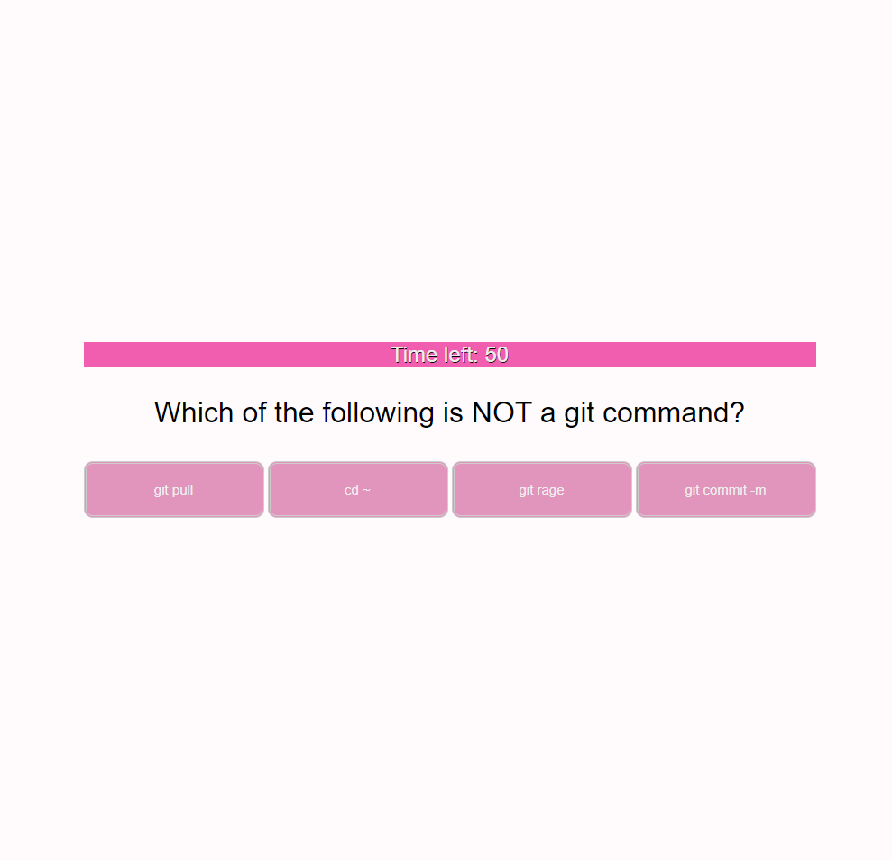

# Week-4-Code-Quiz-Challenge
Week 4 Code Quiz Challenge 

Week 4 - JSS Coding Quiz Challenge submission by Marian Nicole Borja 

Project Overview
---------------------

Students were given the task of creating their own code assessments, similar to some they may encounter in the field. 

Table of Contents
1. Acceptance Criteria
2. Deployed Image
3. Process

Acceptance Criteria
-----------------------
In order to complete this task, students were asked to create a quiz that does the following:

GIVEN I am taking a code quiz
WHEN I click the start button
THEN a timer starts and I am presented with a question
WHEN I answer a question
THEN I am presented with another question
WHEN I answer a question incorrectly
THEN time is subtracted from the clock
WHEN all questions are answered or the timer reaches 0
THEN the game is over
WHEN the game is over
THEN I can save my initials and my score

Deployed Image
-----------------------

Process
-----------------------

Student did the following to achieve requested results.
- Used HTML to create elements on the webpage
- Utilized various CSS to style page to creator's preference (pink, the preference is pink.)
- Practiced Javascript to coordinate functions such as the timer, start button
- Used Javascript to formulate user's quiz questions
- Used Javascript to code out score keeping functionality
- Utilized event listeners 

Contributions
-----------------------
Source code written by Marian "Nicole" Borja
August 2022
